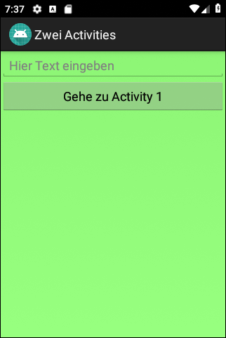
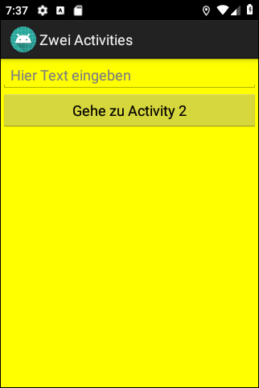

# Android-App "Zwei Activities" (Two Activities) #

 

App demonstrates how to use an **explicit intent** to go from one activity to another activity
of the same app.

 

See also [this app project](https://github.com/MDecker-MobileComputing/Android_DreiActivities)
on how to call different activities and determine in the callback method which of the called
activities was finished.

 

Identifiers (names for classes, variables and methods), UI texts and comments are in German only.

 

----

## Screenshots ##

 

 &nbsp; 

 

----

## License ##

 

See the [LICENSE file](LICENSE.md) for license rights and limitations (BSD 3-Clause License).

 
