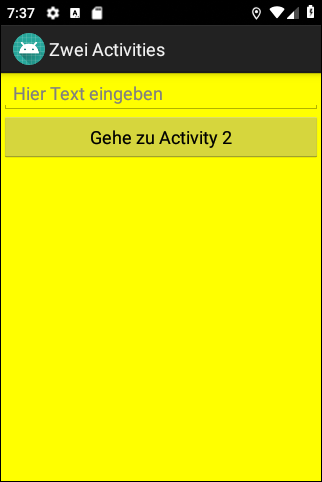

# Android-App "Zwei Activities" #

 

Dieses Repo enthält eine Android-Studio-Projekt für eine native Android-App mit Java.
Die App demonstriert wie man **explizite Intents** benutzt, um von einer zu einer anderen
Activity zu wechseln.

 

Sie auch [diese Android-App](https://github.com/MDecker-MobileComputing/Android_DreiActivities),
die zeigt, wie man beim Rücksprung von einer über expliziten Intent aufgerufenen Activity
erkennt, von welcher Activity der Rücksprung durchgeführt wurde.

 

Identifiers (names for classes, variables and methods), UI texts and comments are in German only.

 

----

## Screenshots ##

 

  

 

----

## License ##

 

See the [LICENSE file](LICENSE.md) for license rights and limitations (BSD 3-Clause License).

 