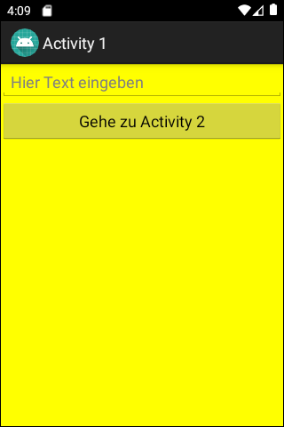
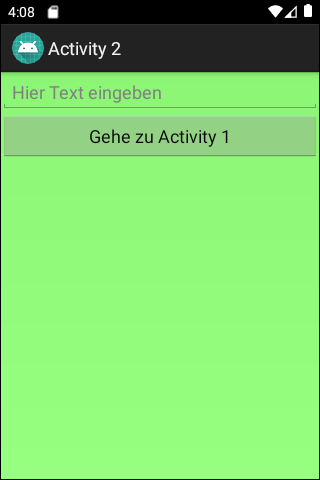

# Android-App "Zwei Activities" (Two Activities)

App demonstrates how to use an **explicit intent** to go from one activity to another activity
of the same app.

 

Identifiers (names for classes, variables and methods), UI texts and comments are in German only.

 

----
## Screenshots

  

 

----
# License

See the [LICENSE file](LICENSE.md) for license rights and limitations (BSD 3-Clause License).
